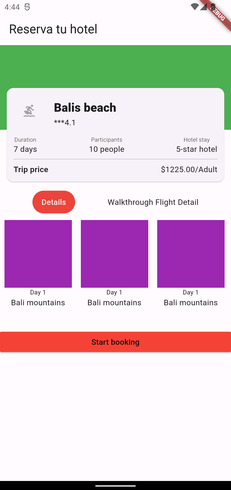

# Tarea 3: Reservar un hotel

App para practicar los siguientes temas:
- Filas, columnas
- Alineación de elementos
- Imágenes
- Textos y estilos
- Overflow de pixeles

## Interfaz base

## Interfaz terminada

